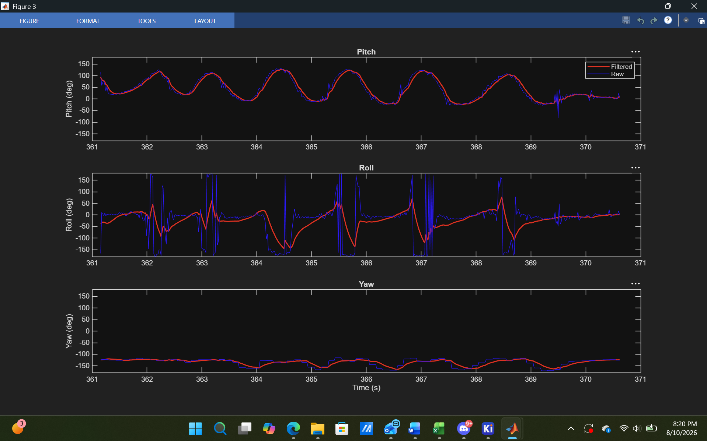

# IMU-Based Attitude Estimation System

Real-time 3D orientation (pitch, roll, yaw) estimation from a 9-axis IMU using a Kalman filter, implemented in MATLAB with live ESP32 sensor streaming.

## Overview

This project estimates an object's orientation in real time by fusing accelerometer, gyroscope, and magnetometer data from an MPU9250 9-axis IMU. Raw inertial sensor data is inherently imperfect, accelerometer readings are noisy, and gyroscope readings drift over time when integrated. A Kalman filter combines both sources to produce a stable, accurate, real-time orientation estimate that outperforms either sensor used alone.

The project followed a deliberate design process: reviewing the MPU9250 datasheet to determine sensor ranges and sensitivity before writing any code, planning the full data pipeline (sensor → firmware → live serial stream → MATLAB filtering → visualization) before implementation, and validating each stage independently before integrating the next.

## Project Approach

1. **Datasheet review** — Determined accelerometer (±2g), gyroscope (±250°/s), and magnetometer sensitivity/range specifications from the MPU9250 datasheet before wiring or coding, to understand expected signal ranges and required unit conversions.
2. **Hardware planning** — Confirmed the MPU9250 breakout's onboard voltage regulator and I2C pull-up/pull-down resistors eliminated the need for external components, simplifying the circuit to a 4-wire I2C connection.
3. **Firmware first** — Validated I2C communication and raw sensor output on the ESP32 before writing any filtering code.
4. **Filter design and validation on synthetic data** — Built and tuned the Kalman filter in MATLAB against generated test data with known ground truth before applying it to real sensor data, to confirm the filter logic worked correctly in isolation.
5. **Real-time integration** — Extended the filter to run on a live serial stream from the ESP32, including gyroscope bias calibration and sensor noise characterization (measured, not assumed) at startup.

## Hardware

| Component | Details |
|---|---|
| Microcontroller | ESP32-WROOM-32 (Dev Module) |
| IMU | MPU9250 9-axis (accelerometer, gyroscope, magnetometer), I2C |

## Wiring Diagram

| MPU9250 Pin | ESP32 Pin | Notes |
|---|---|---|
| VCC | 3.3V | Board has onboard regulator |
| GND | GND | Shared |
| SDA | GPIO 21 | I2C data |
| SCL | GPIO 22 | I2C clock |

No external resistors or capacitors required — the MPU9250 breakout includes onboard I2C pull-up resistors (SDA, SCL, nCS) and pull-down resistors (FSYNC, AD0).

## Signal Processing Pipeline

Each rotation axis is filtered independently, using the sensor pairing appropriate to what each sensor can physically observe:

| Axis | Sensor Inputs | Reasoning |
|---|---|---|
| **Pitch** | AccelX, AccelZ + GyroX | Gravity's component shifts between X/Z as pitch changes |
| **Roll** | AccelY, AccelZ + GyroY | Gravity's component shifts between Y/Z as roll changes |
| **Yaw** | MagX, MagY + GyroZ | Gravity is unaffected by yaw; magnetometer (compass heading) is required to observe rotation about the vertical axis |

**Per-axis Kalman filter steps:**
1. Predict — project the previous angle estimate forward using the gyroscope's angular rate
2. Compute Kalman Gain — weight the prediction against the incoming accelerometer/magnetometer measurement, based on current uncertainty and measured sensor noise
3. Update — blend the prediction and measurement using the gain
4. Update uncertainty for the next iteration

**Calibration performed at startup (not assumed values):**
- Gyroscope bias, measured as the average reading across 500 samples with the sensor at rest
- Accelerometer/magnetometer measurement noise (R), measured as the variance of each angle calculation across 500 samples at rest

## Results

*Filtered orientation estimate (red) vs. raw, unfiltered sensor-derived angle (blue) for all three axes, during live motion. The filtered signal tracks real motion while rejecting sensor noise and short-duration outliers — most visible on the Roll axis, where the raw signal spikes sharply near the ±180° angle-wraparound boundary while the filtered estimate remains stable.*

## Tools Used

- **MATLAB** — Kalman filter implementation, live serial data acquisition, signal analysis, visualization
- **Arduino IDE (C++)** — ESP32 firmware
- **MPU9250_asukiaaa** — Arduino I2C sensor library

## Known Limitations / Future Work

- Yaw estimation is not tilt-compensated; heading accuracy degrades during large simultaneous pitch/roll motion
- Euler angle representation (used here) has an inherent discontinuity at ±180°, visible in the Roll results above; a quaternion-based filter would avoid this
- Filter currently runs in MATLAB rather than on the ESP32 itself; porting the filter to embedded C++ would enable standalone, PC-free operation
- A custom PCB integrating the IMU, ESP32, and power regulation is a natural next step toward a finished, self-contained device

## Author

Cameron Nix — Electrical and Computer Engineering, Oregon State University
[github.com/CameronNix](https://github.com/CameronNix) | [linkedin.com/in/nix-cam-ece](https://linkedin.com/in/nix-cam-ece)
